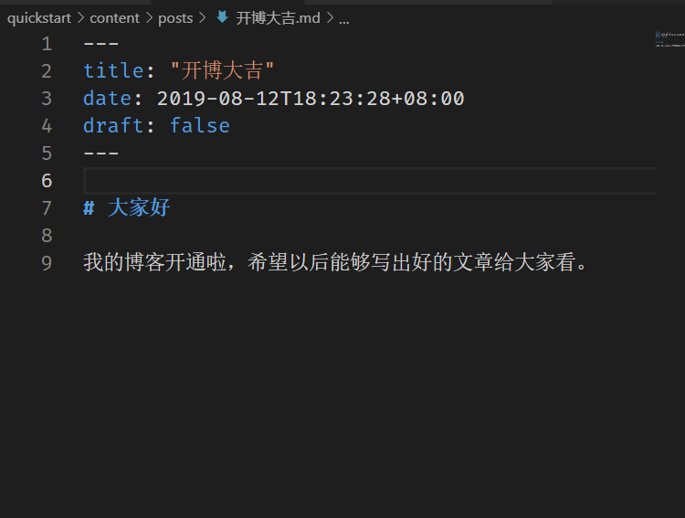
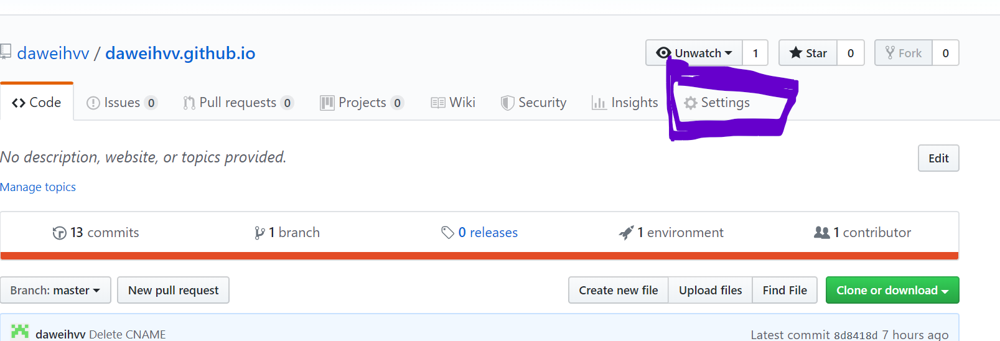
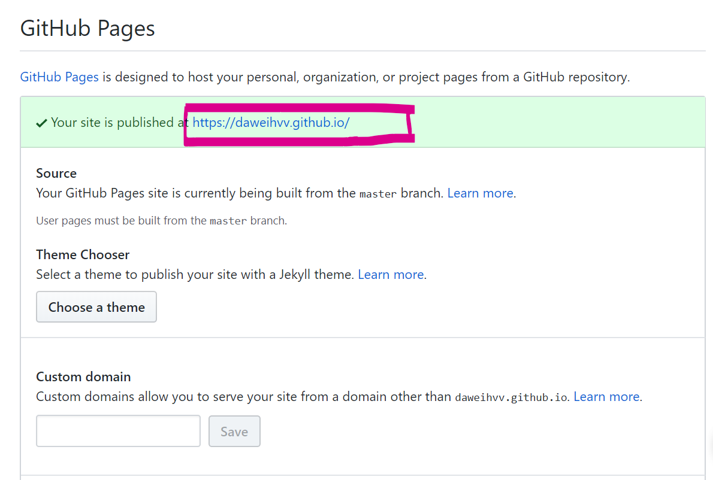

## 安装 hugo.exe（基于 windows）

1. 首先在这个 hugo releases 页面下载适合自己系统版本的 hugo [https://github.com/gohugoio/hugo/releases]
2. 解压后将文件路径提取，添加到 path 里面
3. 重启终端，运行 `hugo version`查看版本

## 配置 hugo

1. 进入 hugo 官网 [https://gohugo.io] 点击 quick start 快速开始
2. 从 set 2 开始抄代码知道 set 7

- set 2

```
hugo new site quickstart
```

- set3 (带#的不用抄)

```
cd quickstart

# Download the theme
git init
git submodule add https://github.com/budparr/gohugo-theme-ananke.git themes/ananke
# Note for non-git users:
#   - If you do not have git installed, you can download the archive of the latest
#     version of this theme from:
#       https://github.com/budparr/gohugo-theme-ananke/archive/master.zip
#   - Extract that .zip file to get a "gohugo-theme-ananke-master" directory.
#   - Rename that directory to "ananke", and move it into the "themes/" directory.
# End of note for non-git users.

# Edit your config.toml configuration file
# and add the Ananke theme.
echo 'theme = "ananke"' >> config.toml
```

- set4 <br>创建并打开 `my-frist-blog.md` 然后可以加上例如这样一句话

```
hugo new posts/my-first-post.md
```

```
---
title: "开博大吉"
date: 2019-03-26T08:47:11+01:00
draft: fleas
---
```



- set5

```
hugo server -D
```

- set6 <br>打开 `config.toml`,加入这些配置

```
baseURL = "https://example.org/"
languageCode = "en-us"
title = "My New Hugo Site"
theme = "ananke"
```

- set7 <br>在 quickstart 目录下运行

```
hugo
```

3. 得到一个 public 目录，这就是我们博客的站点，我们需要在 quickstart 里面加入一个.gitignore，内容是

```
/public/
```

4. 在 github 创建一个新的仓库
5. 将 public 文件夹上传上去
6. 刷新仓库，接着点右上角的 settings <br>
   
7. 找到 github pages 点开自己的博客 <br>
   
